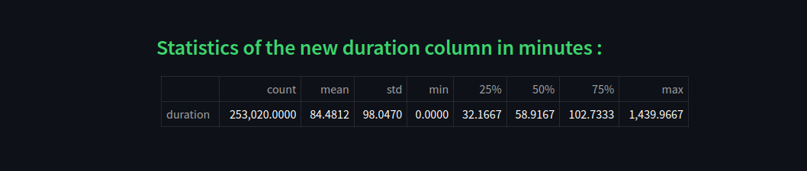

# Exploratory-Data
### Analyse your Data With **PySpark**

 - [Detect Missing Values](./DetectMissingValues/DMV.py)
 - [PySpark Lazy Evaluation](./PysparkLazyEvaluation/PLE.py)
 - [PySpark UDF Registring](./PysparkUdfRegistering/PUR.py)
 - [Unstack PySpark DataFrame](./UnstackPysparkDataframe/UPD.py)
 - [Convert row objects to Spark Resilient Distributed Dataset (RDD)](./RDD/RDD.py)

## Detect Missing Values

 - Detect **Abnormal Zeroes**
 - For string columns, we check for **None** and **Null**
 - For numeric columns, we check for **Zeroes** and **NaN**
 - For array type columns, we check if the array contain **Zeroes** or **NaN**

#### Calculating Total of the Workout Records and Gender Segregation and Counting Their Activity :

   
  
   
   

## PySpark Lazy Evaluation

 - Finding Top 5 **Sports** that have the Most **Users**
 - Checking **Activities** by **Gender**

   
  
   
   

## UNSTACK PYSPARK DATAFRAME

 - Top **Activities** By Gender
 - How many **People** **Participated** in more than 1 **Sport ?**
 - Number of **Users** having more than **10 Workouts**

   
  
   
   

  

## Pyspark UDF Registering

 - Convert a timestamp column into **Datetime.Datetime**
 - Get the duration (in minutes) of a list of datetime values
 - Get the **Workout** start time of the datetime list
 - Get list of intervals within a **Workout**
 - Create new **date_time** column to convert from timestamp into python's datetime format
 - Create **workout_start_time** column to get the start time of each **workout/row**
 - Create interval column from the date_time column

   
  
   
   

  

## RDD
### In Progress
#### guys last part honesty is extremely hard please be patient XD